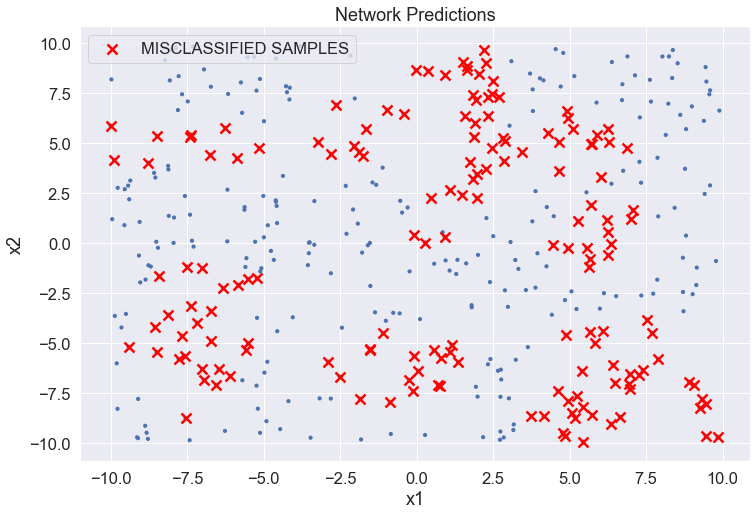
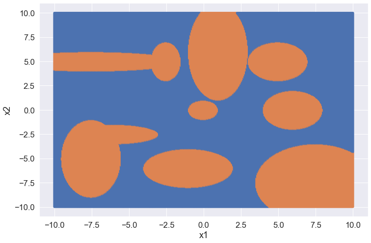
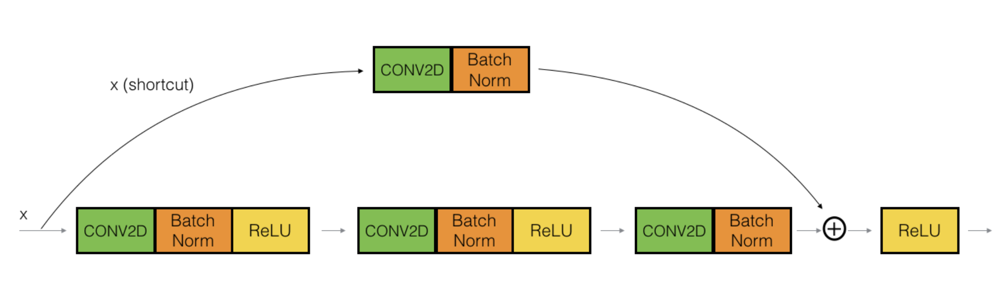
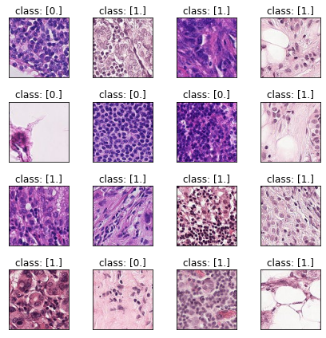
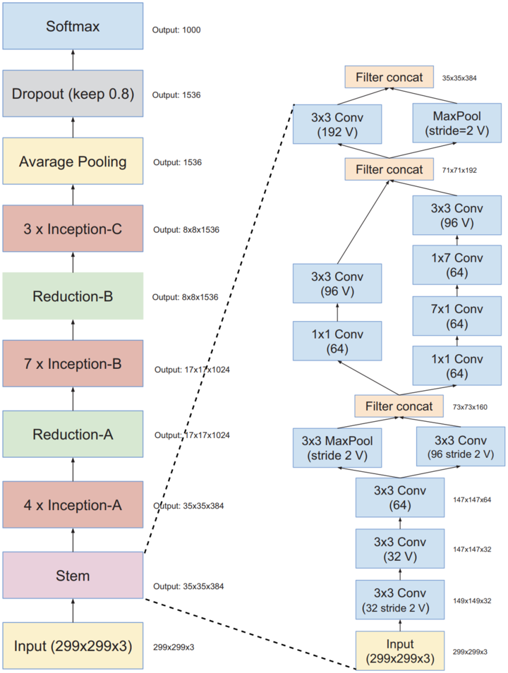

# Neural Networks and Deep Learning

This repository contains my solutions to the programming assignments of the Neural Networks and Deep Learning course of the University of Padova a.y. 2022/2023.

## Table of Contents

#### 1) Linear Regression with Least Squares
In [LSlinear_regression](https://github.com/nicolezattarin/Neural-Networks-Deep-Learning/blob/main/src/LSlinear_regression.ipynb) we provide a basic implementation of linear regression using least squares, both with and without regularization. 

#### 2) Introduction to PyTorch functionalities
The notebook available at [PyTorch](https://github.com/nicolezattarin/Neural-Networks-Deep-Learning/blob/main/src/PyTorch_basics.ipynb) provides a brief introduction to the PyTorch functionalities, such as the definition of tensors, the use of autograd, the definition of neural networks and datasets, the use of optimizers and the definition of loss functions.

#### 3) Regression with Feedforward Neural Networks
Example of a feed forward neural network for linear regression, implemented with PyTorch. The notebook is available at [PyTorch_linear_regression](https://github.com/nicolezattarin/Neural-Networks-Deep-Learning/blob/main/src/FFNN_regression.ipynb).

#### 4) Binary Classification with Feedforward Neural Networks
Example of a feed forward neural network for binary classification, implemented with PyTorch. The notebook is available at [PyTorch_binary_classification](https://github.com/nicolezattarin/Neural-Networks-Deep-Learning/blob/main/src/FFNN_classification.ipynb).
An example of model and classification results is shown below.

  
  

#### 5) Residual Networks for Image Classification
We implement a ResNet model for image classification, the architecture is based on CNN, among with the combination of convolutional and identity blocks. The notebook is available at [ResNet](https://github.com/nicolezattarin/Neural-Networks-Deep-Learning/blob/main/src/ResNet.ipynb).

Example of the dataset and the model architecture is shown below.

  
  

#### 6) Inception-v4 network for Image Classification
We implement an Inception-v4 model for image classification,
the architecture consists of three different block types: *Inception blocks*, the *Reduction blocks* and *stem block*. The notebook is available at [Inception-v4](https://github.com/nicolezattarin/Neural-Networks-Deep-Learning/blob/main/src/inceptionv4.ipynb).

 

The dataset is the same as in the previous exercise.

